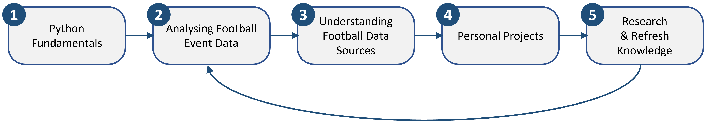

# Getting Started: Football Data Analytics with Python
The aim of this short document is to provide some guidance and advice on getting started with football data analytics using Python.

There are a huge number of relevant resources out there already, but I thought it worth providing my perspectives on the topic and outlining the path that I took into football data analytics. Please note that this document only covers the technical aspects of getting started, and does not provide guidance on starting a career within the football industry (nor am I qualified to provide this).

## Roadmap
I have put together a basic roadmap that identifies a logical sequence of activities that you may choose to undertake to get started with football data. I will expand on each activity in the following sections.

   &nbsp &nbsp 

## Step 1 - Python Fundamentals

One of the most common mistakes I have seen, and therefore a key piece of advice I have is; don't try and run before you can walk. Whilst it is seriously tempting to immerse yourself in football data immediately, it's critical that you develop a thorough understanding of the Python programming language before-hand. In taking the time to learn the fundamentals of Python coding as part of a wider analytics skill-set, you will better position yourself to develop as a football data analyst.

I have listed a few courses below that I have completed and highly recommend. It wouldn't be excessive to spend 1-3 months learning Python before you get started with football data.

|Course Name|Platform|Time Commitment|Cost|
|----------|:-------------:|:------:|:------:|
|[Learning to Program with Python 3](https://www.youtube.com/playlist?list=PLQVvvaa0QuDeAams7fkdcwOGBpGdHpXln)|YouTube|5-10Hrs|Free|
|[Python Tutorial for Beginners](https://www.youtube.com/watch?v=YYXdXT2l-Gg&list=PL-osiE80TeTskrapNbzXhwoFUiLCjGgY7&ab_channel=CoreySchafer)|YouTube|10-20Hrs|Free|
|[Complete Python Bootcamp](https://www.udemy.com/course/complete-python-bootcamp/)|Udemy|20-40Hrs|£15.99 (offer)|
|[Python for Data Science & Machine Learning](https://www.udemy.com/course/python-for-data-science-and-machine-learning-bootcamp/)|Udemy|20-40Hrs|£15.99 (offer)|

## Step 2 - Analysing Football Event Data

With the fundamentals of Python nailed down, you can move onto the good bit! There is an absolutely essential resource that will get you started with analysing football event data. Uppsala University (Sweden) run an online course called [Mathematical Modelling of Football](https://soccermatics.readthedocs.io/en/latest/). It is delivered by the author of Soccermatics, [David Sumpter](https://www.david-sumpter.com/), who has kindly made the majority of lectures/resources publically available.

I would strongly recommend that you not only watch, but follow along with the course material. Prioritise the first three sections; event data, models and scouting. These sections will get you up to speed with crucial football data analytics topics, as well as provide invaluable guidance on producing effective visuals. The remaining sections; valuing actions, randomness & prediction, pitch control, positioning & movmement, and physical data, cover more advanced topics but are still well worth completing.  

## Step 3 - Understanding Football Data Sources

Before going at it alone, it's important to understand what football data exists in the public domain, and equally what doesn't? What do you have to pay for, and what's available for free? 

Through taking the time to consider this, you can appropriately scope your future projects and ensure that the data required to complete them is actually available. If you have completed various sections of the [Mathematical Modelling of Football](https://soccermatics.readthedocs.io/en/latest/) course, then you will likely have at least some awareness of what data is available and accessible. 

In my experience, working with different types/formats of football data not only stretches you from a technical programming perspective, but encourages you to think about different ways to process and draw insight from football data. When getting started with football data analytics, I believe the following sources of free data are key.

|Data Provider|Data Description|Data Format|
|----------|-------------|:------:|
|[Statsbomb Open Data](https://github.com/statsbomb/open-data)|Statsbomb match event data from a collection of games and competitions|[API](https://github.com/statsbomb/statsbombpy) or [.json](https://github.com/statsbomb/open-data)|
|[Wyscout Free Data](https://figshare.com/collections/Soccer_match_event_dataset/4415000/2)|Wyscout match event data for all matches in Europe's top 5 leagues during 2017-18 season|[.json](https://figshare.com/collections/Soccer_match_event_dataset/4415000/2)|
|[Understat](https://understat.com/)|Shot event data for all matches in Europe's top 5 leages (+ Russian Prem)|[API](https://pypi.org/project/understatapi/) or [Web](https://understat.com/)|
|[FBref](https://fbref.com/en/)|Aggregated team and player data/performance metrics|[Web](https://fbref.com/en/), .xlsx or .csv|
|[Transfermarkt](https://www.transfermarkt.co.uk/)|Team and player market value|[Web](https://www.transfermarkt.co.uk/)|

There are many more data sources, the majority of which are listed and explained within Edd Webster's brilliant [football analytics repository](https://github.com/eddwebster/football_analytics#data-sources). Given the number of web-based resources around, any time spent understanding the basics of web-scraping with Python is time well spent. 

## Step 4 - Personal Projects

Now it's time to go alone... there is no better way to consolidate learning than through practicing, testing and experimentation. With an understanding of football data analytics principles and an awareness of what data is available to you, it's likely you have formulated some project ideas already. Go with them! Explore the data and don't be afraid to change the direction of your project if something in particular piques your interest!

If you are struggling, here's a list of ideas:
- Identify (and visualise) which players frequently passed the ball into the opposition box (in-play only) during the 2018 World Cup
- Highlight pitch areas that each team lost possession of the ball during the 2018 World Cup. Link this to team performance
- Highlight pitch areas that each team created shots/chances from during the 2018 World Cup. Link this to team performance
- Create a function that identifies every time a forward receives a long ball, their next action, and whether they hold the ball up successfully
- Define and implement some bespoke metrics that quantify how well a defender/midfield/forward performed during the 2018 World Cup
- Build an xG model using data from Europe's top 5 leagues during the 2017/18 season
- Build a tool to extract and visualise shot event data from Understat 
- Develop a model that attempts to predict player market value from seasonal performance (for a specific player position)
- Implement an expected threat model, and use it to determine the value of all actions during the 2017/18 season in Europe's top 5 leagues
- Build a tool that quickly produces a scatter plot to compare a set of players against 2 FBref metrics

When you have completed a project and are happy with your work, post it! Whilst this might seem daunting, Twitter is a great place to share your work and obtain feedback. Feel free to send me your work directly and I'll take a look too.

## Step 5 - Research & Refresh Knowledge

The final step, and one that should not be underestimated, is to maintain and refresh your knowledge. Continous learning will further develop your data analytics skillset and help you to bring fresh ideas and concepts into your personal projects. Go back and revisit course topics if you need to, and keep on top of public data releases.

There is a huge amount of research and development that is taking place in the football analytics community, and I'd recommend at least being aware of it. One of the best ways to do this is to take a look at [Jan Van Haaren's](https://www.janvanhaaren.be/) annual soccer analytics review (e.g. [2022 soccer analytics review](https://www.janvanhaaren.be/2022/12/29/soccer-analytics-review-2022.html)). Even if you only scan through the research paper titles, you will at least get an indication of trending research topics and the state-of-the-art in football data analytics.

## Summary

And that's about it! Hopefully this resource has been useful. Please feel free to reach out to me ([@_JKDS_](https://twitter.com/_JKDS_)) if you have any questions or thoughts!
