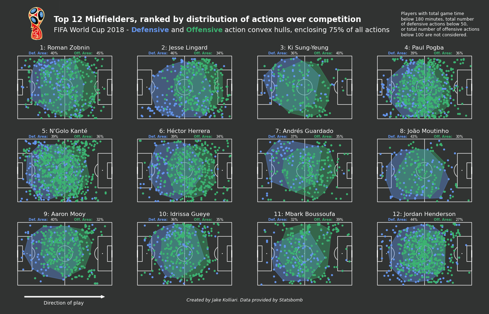
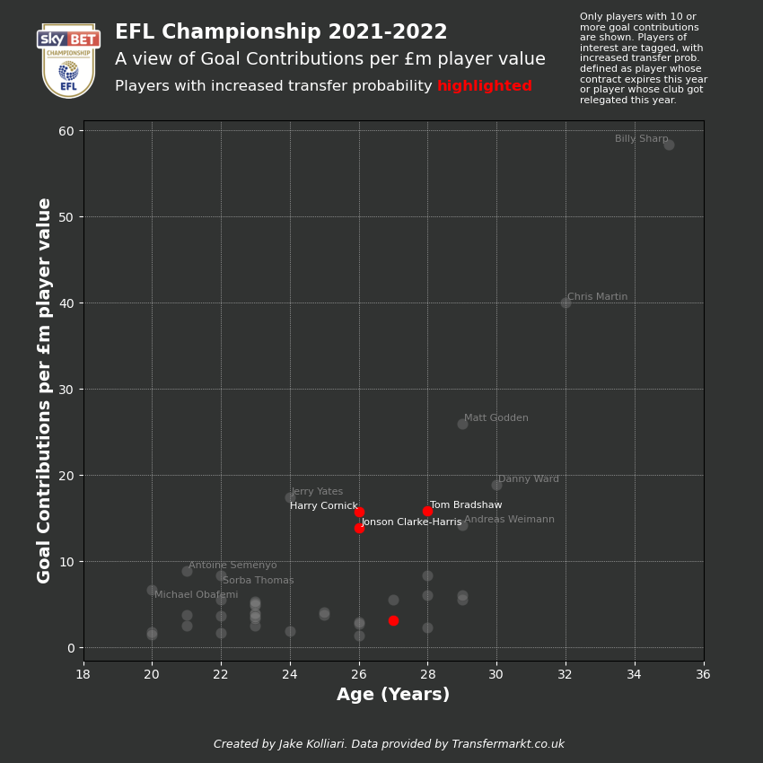
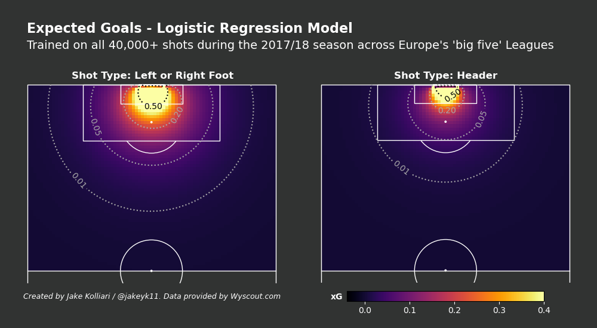
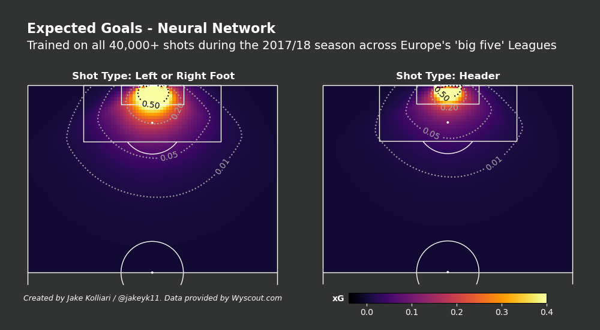
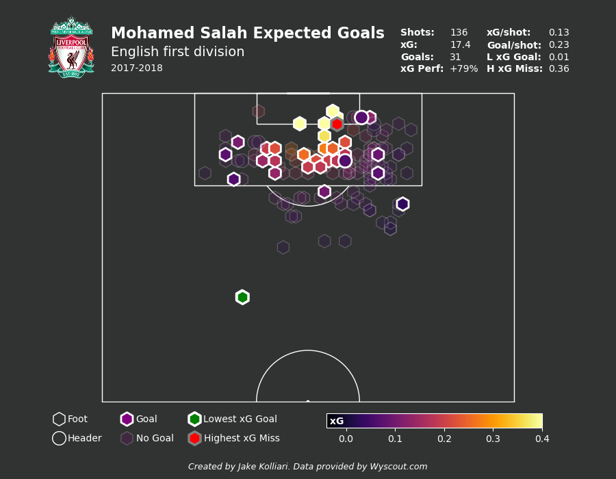
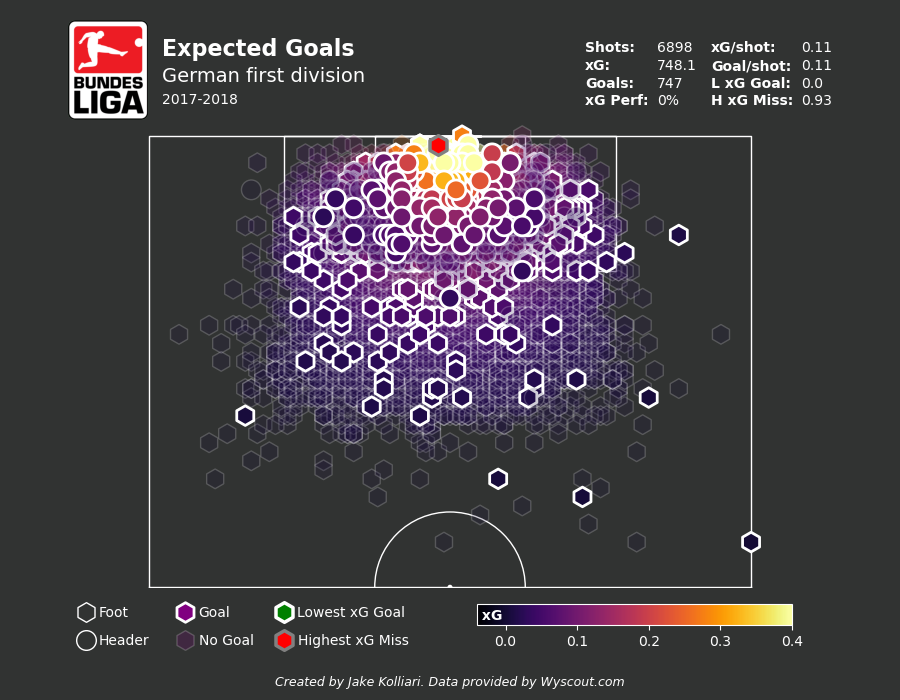
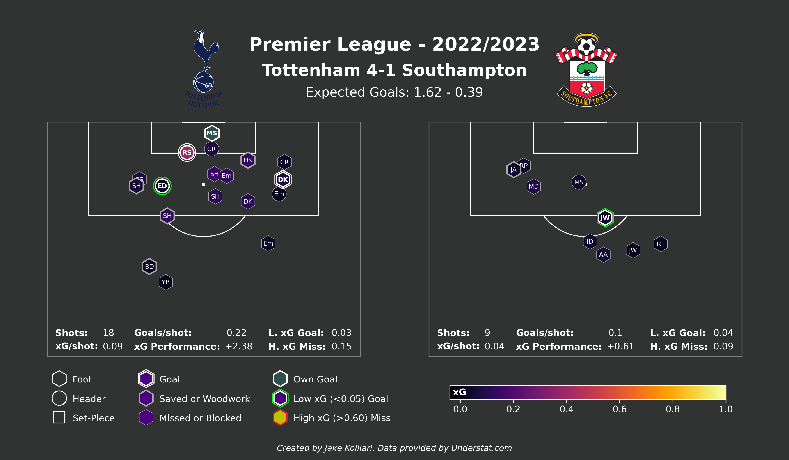
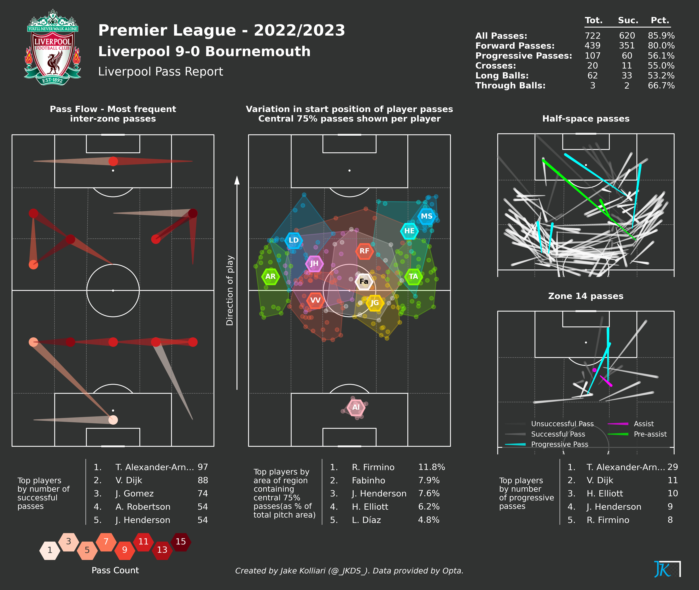
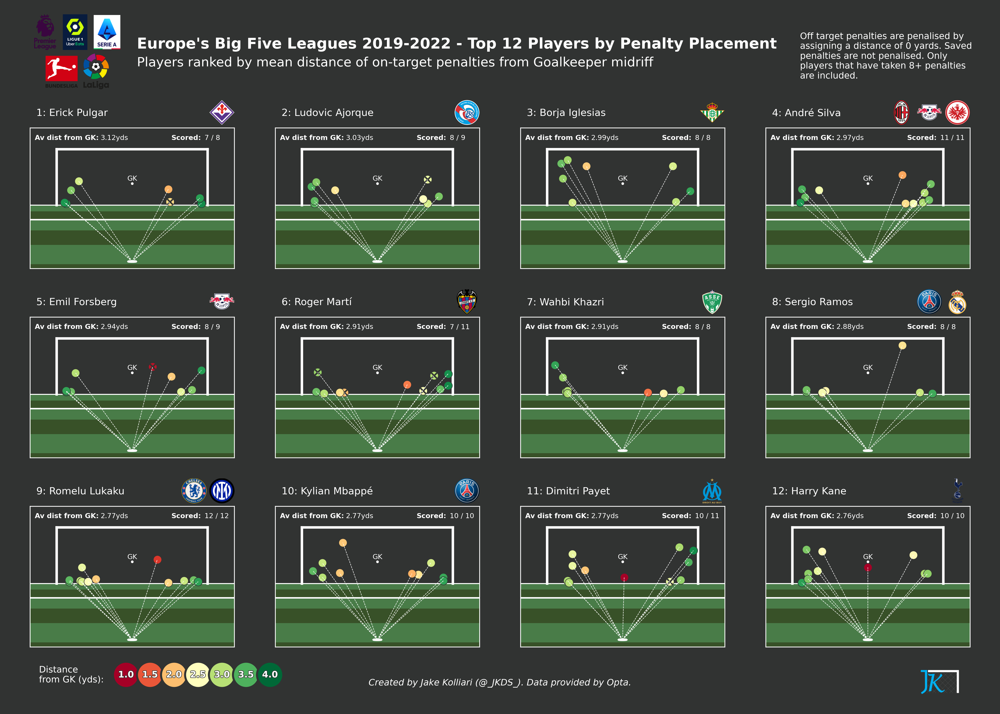
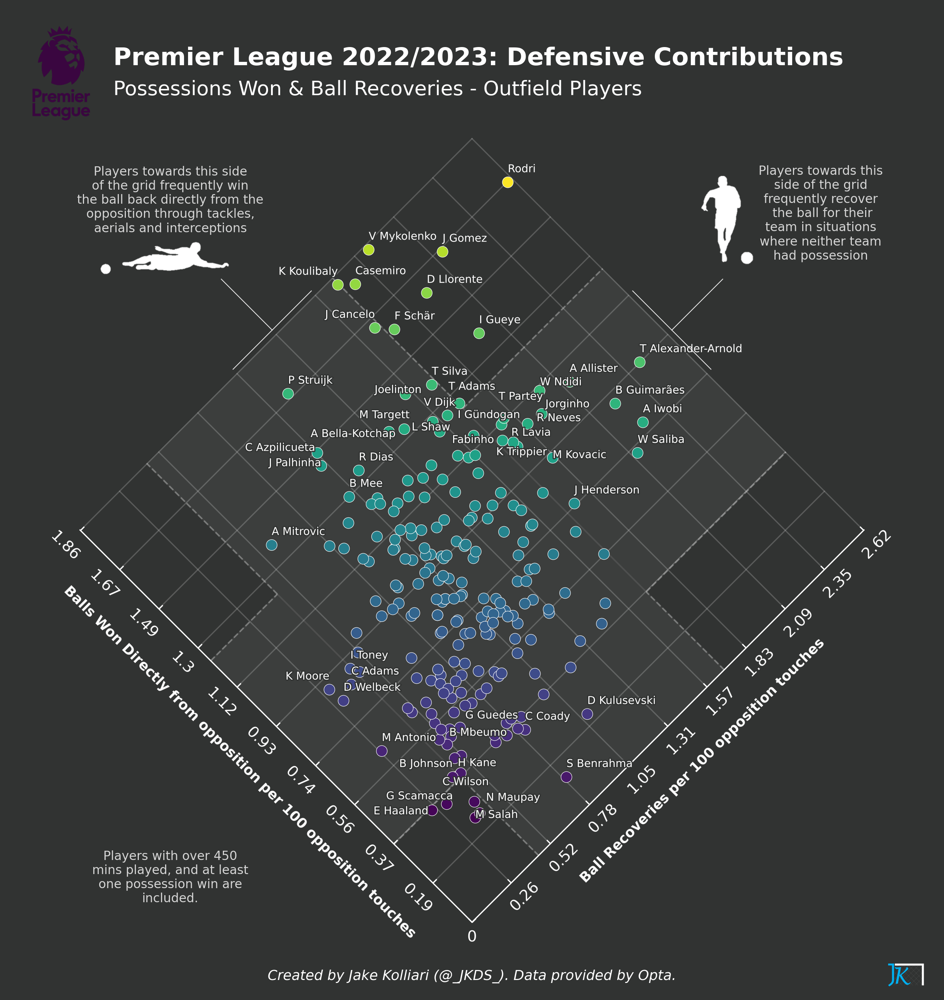

# Football Data Analytics
This repository contains a collection of tools, projects and resources that enable effective analysis and visualisation of football data.

## Contents

  
Table of Contents

  <ol>
    <li><a href="#introduction"> ➤ Introduction</a></li>
    <li><a href="#folder-structure"> ➤ Folder Structure</a></li>
    <li><a href="#workflow"> ➤ Workflow</a></li>
    <li>
      <a href="#projects"> ➤ Projects</a>
      <ul>
        <li><a href="#01---world-cup-2018-box-to-box-midfielder-analysis">01 - World Cup 2018 Box to Box Midfielder Analysis</a></li>
        <li><a href="#02---transfermarkt-web-scrape-and-analyse">02 - Transfermarkt Web-Scrape and Analyse</a></li>
        <li><a href="#03---expected-goals-modelling">03 - Expected Goals Modelling</a></li>
        <li><a href="#04---automated-match-reporting">04 - Automated Match Reporting</a></li>
        <li><a href="#05---automated-competition-reporting">05 - Automated Competition Reporting</a></li>
      </ul>
    </li>
  </ol>

## Introduction
This repository contains a collection of tools, projects and resources that aim to support the generation of meaningful insight from football data. Python is used for extraction, processing, analysis and visualisation of event data, aggregated team data, market value data and more.

The repository is broken down into mutliple projects and sub-projects, each of which aims to either perform a detailed analysis, generate some specific insight, or introduce some level of automation to football data analytics. Using the contents of this repository, a number of novel & informative visuals and text threads have been created and shared with the football data analytics community via Twitter ([@\_JKDS\_](https://twitter.com/_JKDS_)).

To support others who are wishing to develop their data analytics skills within the context of football data, I have produced a [Getting Started Guide](https://github.com/jakeyk11/football-data-analytics/blob/main/Getting%20Started%20with%20Football%20Analytics.md).

## Folder Structure

The tree below presents the folder structure of this git repository. Note that some individual files are omitted from the diagram for simplicity.

    football-data-analytics
    │
    ├── analysis_tools
    │   ├── __init__.py
    │   ├── get_football_data.py [not included in git repo]
    │   ├── logos_and_badges.py
    │   ├── pitch_zones.py
    │   ├── statsbomb_custom_events.py
    │   ├── statsbomb_data_engineering.py
    │   ├── whoscored_custom_events.py
    │   ├── whoscored_data_engineering.py
    │   ├── wyscout_data_engineering.py   
    │ 
    ├── data_directory
    │   ├── misc_data
    │   │   ├── images
    │   ├── statsbomb_data [contents not included in git repo]
    │   ├── transfermarkt_data
    │   ├── whoscored_data [contents not included in git repo]
    │   ├── wyscout_data
    │
    ├── projects
    │   ├── 00_data_import_and_misc_work
    │   │   ├── download_yt_video.py 
    │   │   ├── import_data_whoscored.py
    │   │   ├── saudi_arabia_argentina_world_cup_def_actions.py 
    │   │   ├── scrape_data_transfermarkt.py
    │   ├── 01_wc2018_box2box_mids_statsbomb
    │   │   ├── worldcup_b2b_mids.py
    │   ├── 02_player_team_valuation_transfermarkt
    │   │   ├── championship_forward_value_analysis.py
    │   │   ├── premierleague_forward_value_analysis.py
    │   ├── 03_xg_modelling_wyscout
    │   │   ├── shot_xg_plot.py
    │   │   ├── xg_log_regression_model.py
    │   │   ├── xg_neural_network.py  
    │   ├── 04_match_reports_opta
    │   │   ├── pass_report_ws.py
    │   │   ├── shot_report_understat.py     
    │   ├── 05_competition_reports_top_players_opta
    │   │   ├── player_defensive_contribution.py
    │   │   ├── player_effective_carriers.py
    │   │   ├── player_effective_passers.py
    │   │   ├── player_high_defensive_actions.py    
    │   │   ├── player_penalty_takers.py
    │   │   ├── player_threat_creators.py
    │   ├── 06_competition_reports_top_teams_opta
    │   │   ├── team_ball_winning.py
    │   │   ├── team_cross_success.py    
    │   │   ├── team_fullback_combinations.py
    │   │   ├── team_threat_creation.py
    │   ├── 07_player_reports_opta
    │   │   ├── player_report_fullback.py
    │ 
    ├── .gitignore
    |
    ├── Getting Started with Football Analytics.md
    │     
    ├── LICENSE 
    │ 
    ├── README.md 

## Workflow

As shown in the folder structure above, the repository contains three key folders:
- **data_directory**: Storage of raw football data used for projects.
- **analysis_tools**: Custom python package containing modules that support football data import, processing, manipulation and visualisation.
- **projects**: Series of projects that cover various elements of football data analytics. Also contains any template scripts used to import raw data from various football data APIs, websites or data services.

In general, each project follows a number of logical steps:
1. Use analysis_tools package: get_football_data module [note this module is not available within the git repo] to import required data from football data API, website or data service:
    * Save to data_directory area in compressed BZ2 format
2. Create a folder within the Projects area to store files associated with the project.
3. Create an analysis script within the new folder, and import any required modules from the analysis_tools package.
4. Pre-process and format data using data_engineering modules within the analysis_tools package.
5. Synthesise additional information using custom_events and pitch_zones modules within the analysis_tools package.
6. With data formatted appropriately, create visuals and generate insight for end-consumer. Use logos_and_badges module to bring in team/compeition logos.

## Projects

Project table of contents:  
&nbsp; &nbsp; [01 - World Cup 2018 Box to Box Midfielder Analysis](#01---world-cup-2018-box-to-box-midfielder-analysis)  
&nbsp; &nbsp; [02 - Transfermarkt Web-Scrape and Analyse](#02---transfermarkt-web-scrape-and-analyse)  
&nbsp; &nbsp; [03 - Expected Goals Modelling](#03---expected-goals-modelling)  
&nbsp; &nbsp; [04 - Automated Match Reporting](#04---automated-match-reporting)  
&nbsp; &nbsp; [05 - Automated Competition Reporting](#05---automated-competition-reporting)

### 01 - World Cup 2018 Box to Box Midfielder Analysis

**Summary**: Use Statsbomb data to define the most effective box to box midfielders at the 2018 World Cup. Throughout the work a number of custom metrics are used to score central midfielders in ball winning, ball retention & creativity, and mobility. A good box to box midfielder is defined as a central midfielder that excels in each of these areas. Of key interest in this work is the use of convex hulls as a proxy for player mobility / distance covered. The work also includes the development of a number of appealing visuals, as shown below.

   &nbsp &nbsp 
   &nbsp &nbsp
  

### 02 - Transfermarkt Web-Scrape and Analyse

**Summary:** Scrape team and player market value information from transfermarkt.co.uk. This work includes the development of a "scouting tool" that highlights players from a given league that have a favourable combination of Age and Goal Contribution per £m market value. The work also explores the use of statistical models to predict market value based on player performance, as well as identifies teams that under and over-performed (league position) based on squad value.

   &nbsp &nbsp
   &nbsp &nbsp
  

### 03 - Expected Goals Modelling

**Summary:** Implementation and testing of basic expected goals probabilistic models. This work includes development and comparison of a logistic regression expected goals model and a neural network expected goals model, each trained off over 40000 shots taken across Europe's 'big five' leagues during the 2017/2018 season. The models are used to calculated expected goals for specific players, clubs and leagues over a specified time period.

   &nbsp &nbsp
   &nbsp &nbsp

   &nbsp &nbsp
   &nbsp &nbsp
   &nbsp &nbsp

### 04 - Automated Match Reporting

**Summary:** Development of automated scripts to produce match reports immediately after a match has concluded. This work includes collection and processing of public-domain match event data, and the production of multiple visuals that together constitute informative and appealing match reports. Visuals currently include shot maps, inter-zone passflows, pass plots and offensive action convex hulls.

   &nbsp &nbsp
   &nbsp &nbsp

   &nbsp &nbsp
   &nbsp &nbsp

### 05 - Automated Competition Reporting

**Summary:** Development of automated scripts to produce competition reports and multi-match player evaluations at any point throughout a competition. This work includes collection and processing of public-domain match event data, and the production of multiple visuals that generate novel and meaningful insight at a team and player level. Visuals currently include an assessment of progressive passes, defensive actions and penalty placement.

   &nbsp &nbsp 
  

   &nbsp &nbsp 
  

