# Football Data Analytics
This repository contains a collection of tools, projects and resources that enable effective analysis and visualisation of football data.

## Contents

  
Table of Contents

  <ol>
    <li><a href="#introduction"> ➤ Introduction</a></li>
    <li><a href="#folder-structure"> ➤ Folder Structure</a></li>
    <li><a href="#workflow"> ➤ Workflow</a></li>
    <li><a href="#projects"> ➤ Projects</a></li>
  </ol>

## Introduction
This repository contains a collection of tools, projects and resources that aim to support the generation of meaningful insight from football data. Python is used for extraction, processing, analysis and visualisation of event data, aggregated team data, market value data and more.

The repository is broken down into mutliple projects and sub-projects, each of which aims to either perform a detailed analysis, generate some specific insight, or introduce some level of automation to football data analytics. Using the contents of this repository, a number of novel & informative visuals and text threads have been created and shared with the football data analytics community via Twitter ([@\_JKDS\_](https://twitter.com/_JKDS_)).

To support others who are wishing to develop their data analytics skills within the context of football data, I have produced a [Getting Started Guide](https://github.com/jakeyk11/football-data-analytics/blob/main/Getting%20Started%20with%20Football%20Analytics.md).

## Folder Structure

The tree below presents the folder structure of this git repository. Note that some individual files are omitted from the diagram for simplicity.

    football-data-analytics
    │
    ├── analysis_tools
    │   ├── __init__.py
    │   ├── get_football_data.py [not included in git repo]
    │   ├── logos_and_badges.py
    │   ├── pitch_zones.py
    │   ├── statsbomb_custom_events.py
    │   ├── statsbomb_data_engineering.py
    │   ├── whoscored_custom_events.py
    │   ├── whoscored_data_engineering.py
    │   ├── wyscout_data_engineering.py   
    │ 
    ├── data_directory
    │   ├── misc_data
    │   │   ├── images
    │   ├── statsbomb_data [contents not included in git repo]
    │   ├── transfermarkt_data
    │   ├── whoscored_data [contents not included in git repo]
    │   ├── wyscout_data
    │
    ├── projects
    │   ├── 00_data_import_and_misc_work
    │   │   ├── download_yt_video.py 
    │   │   ├── import_data_whoscored.py
    │   │   ├── saudi_arabia_argentina_world_cup_def_actions.py 
    │   │   ├── scrape_data_transfermarkt.py
    │   ├── 01_wc2018_box2box_mids_statsbomb
    │   │   ├── worldcup_b2b_mids.py
    │   ├── 02_player_team_valuation_transfermarkt
    │   │   ├── championship_forward_value_analysis.py
    │   │   ├── premierleague_forward_value_analysis.py
    │   ├── 03_xg_modelling_wyscout
    │   │   ├── shot_xg_plot.py
    │   │   ├── xg_log_regression_model.py
    │   │   ├── xg_neural_network.py  
    │   ├── 04_match_reports_opta
    │   │   ├── pass_report_ws.py
    │   │   ├── shot_report_understat.py     
    │   ├── 05_competition_reports_top_players_opta
    │   │   ├── player_defensive_contribution.py
    │   │   ├── player_effective_carriers.py
    │   │   ├── player_effective_passers.py
    │   │   ├── player_high_defensive_actions.py    
    │   │   ├── player_penalty_takers.py
    │   │   ├── player_threat_creators.py
    │   ├── 06_competition_reports_top_teams_opta
    │   │   ├── team_ball_winning.py
    │   │   ├── team_cross_success.py    
    │   │   ├── team_fullback_combinations.py
    │   │   ├── team_threat_creation.py
    │   ├── 07_player_reports_opta
    │   │   ├── player_report_fullback.py
    │ 
    ├── .gitignore
    |
    ├── Getting Started with Football Analytics.md
    │     
    ├── LICENSE 
    │ 
    ├── README.md 

## Workflow

As shown in the folder structure above, the repository contains three key folders:
- **data_directory**: Storage of raw football data used for projects.
- **analysis_tools**: Custom python package containing modules that support football data import, processing, manipulation and visualisation.
- **projects**: Series of projects that cover various elements of football data analytics. Also contains any template scripts used to import raw data from various football data APIs, websites or data services.

In general, each project follows a number of logical steps:
1. Use analysis_tools package: get_football_data module [note this module is not available within the git repo] to import required data from football data API, website or data service:
    * Save to data_directory area in compressed BZ2 format
2. Create a folder within the Projects area to store files associated with the project.
3. Create an analysis script within the new folder, and import any required modules from the analysis_tools package.
4. Pre-process and format data using data_engineering modules within the analysis_tools package.
5. Synthesise additional information using custom_events and pitch_zones modules within the analysis_tools package.
6. With data formatted appropriately, create visuals and generate insight for end-consumer. Use logos_and_badges module to bring in team/compeition logos.

## Projects

Projects are numbered based on the numerical identifier of the project folder area in which they have been undertaken and stored. Decimals are used when more than one sub-project/piece of work has been undertaken in the same folder area. For example, sub-project 2.1 and 2.2 are two seperate pieces of work that exist within project 2, which is stored within folder area 02_player_team_valuation_transfermarkt. Select a project title to expand the drop-down and find out more.

### 1 - Targeted Player & Team Performance Analysis

1.1 - World Cup 2018 Box to Box Midfielder Analysis

\
**Data Source:** Statsbomb & FIFA Match Reports

**Project Area:** [01_wc2018_box2box_mids_statsbomb](https://github.com/jakeyk11/football-data-analytics/tree/main/projects/01_wc2018_box2box_mids_statsbomb)

**Code:** [worldcup_b2b_mids.py](https://github.com/jakeyk11/football-data-analytics/blob/main/projects/01_wc2018_box2box_mids_statsbomb/worldcup_b2b_mids.py)

**Summary and Output:** An investigation of the most effective box to box midfielders at the 2018 World Cup. A number of custom metrics are used to score central midfielders in ball winning, ball retention & creativity, and mobility. A good box to box midfielder is defined as a central midfielder that excels in each of these areas.

   &nbsp &nbsp 
  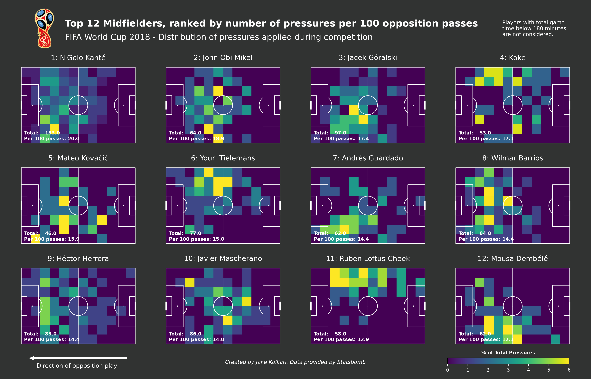

  

### 2 - Player and Team Market Value Analysis

2.1 - Scouting Players on Goal Contribution per £m Market Value

\
**Data Source:** Transfermarkt

**Project Area:** [00_data_import_and_misc_work](https://github.com/jakeyk11/football-data-analytics/tree/main/projects/00_data_import_and_misc_work) & [02_player_team_valuation_transfermarkt](https://github.com/jakeyk11/football-data-analytics/tree/main/projects/02_player_team_valuation_transfermarkt)

**Code:** [scrape_data_transfermarkt.py](https://github.com/jakeyk11/football-data-analytics/blob/main/projects/00_data_import_and_misc_work/scrape_data_transfermarkt.py) & [team_player_value_analysis.py](https://github.com/jakeyk11/football-data-analytics/blob/main/projects/02_player_team_valuation_transfermarkt/team_player_value_analysis.py)

**Summary and Output:** 
Development of a tool to scrape team and player market value information from transfermarkt.co.uk. Generation of a "scouting visual" that highlights players from a given league with a favourable combination of Age and Goal Contribution per £m market value. The work also explores the use of statistical models to predict market value based on player performance.

  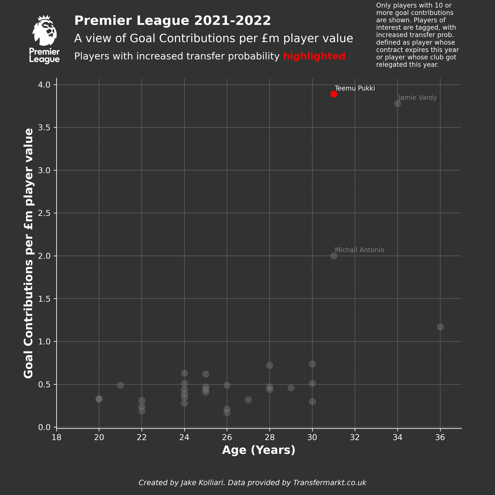 &nbsp &nbsp
  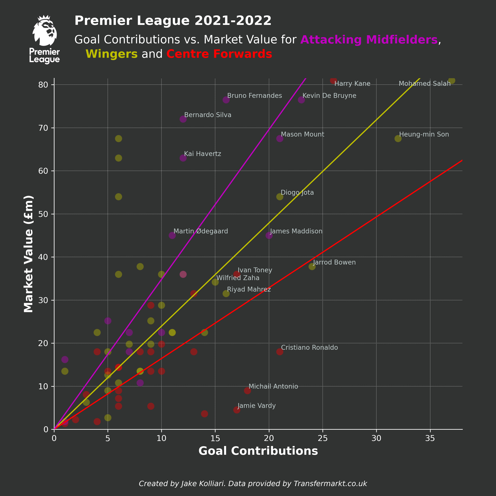

  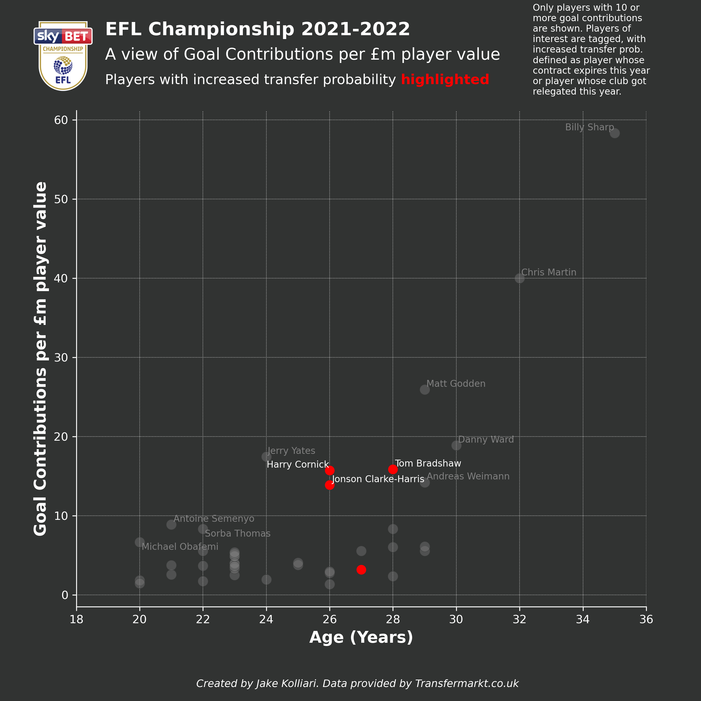 &nbsp &nbsp
  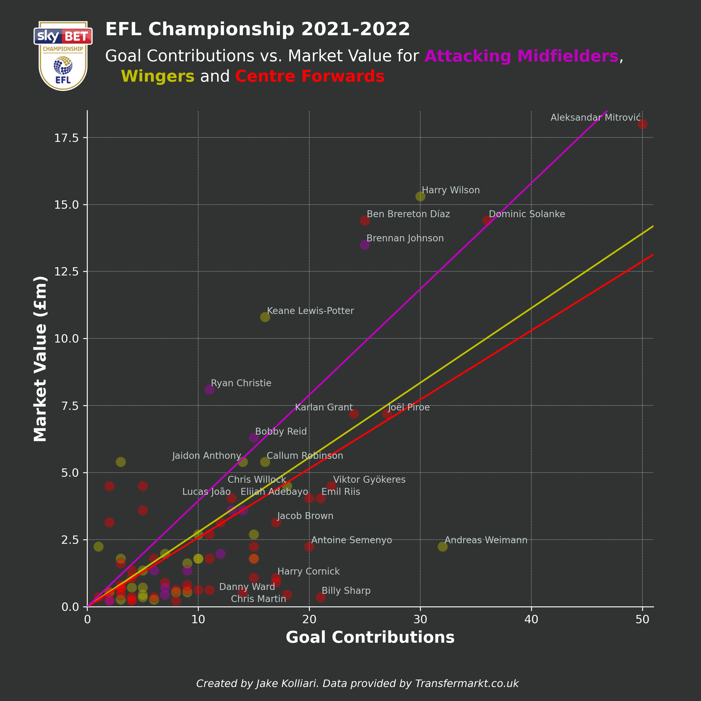

2.2 - Team Market Value League Table

\
**Data Source:** Transfermarkt

**Project Area:** [00_data_import_and_misc_work](https://github.com/jakeyk11/football-data-analytics/tree/main/projects/00_data_import_and_misc_work) & [02_player_team_valuation_transfermarkt](https://github.com/jakeyk11/football-data-analytics/tree/main/projects/02_player_team_valuation_transfermarkt)

**Code:** [scrape_data_transfermarkt.py](https://github.com/jakeyk11/football-data-analytics/blob/main/projects/00_data_import_and_misc_work/scrape_data_transfermarkt.py) & [team_player_value_analysis.py](https://github.com/jakeyk11/football-data-analytics/blob/main/projects/02_player_team_valuation_transfermarkt/team_player_value_analysis.py)

**Summary and Output:** 
Development of a tool to scrape team and player market value information from transfermarkt.co.uk. Investigation of team under/over-performance based on league ranking and total squad value ranking.

  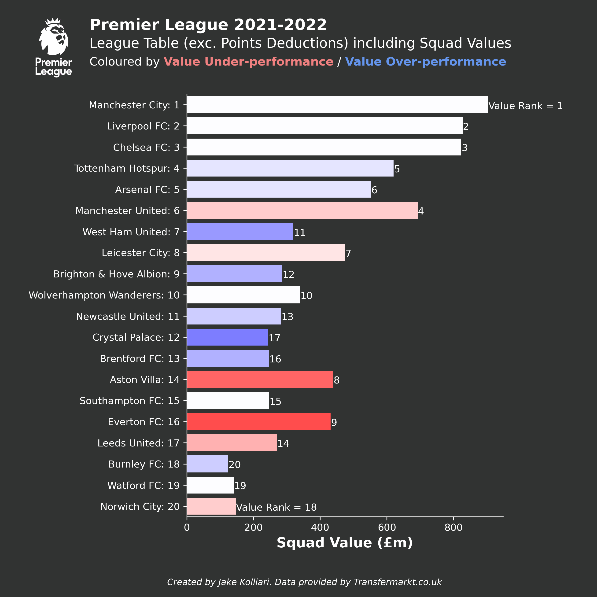 &nbsp &nbsp
  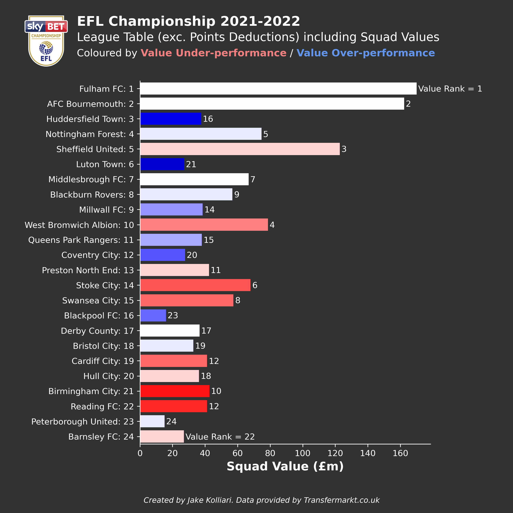

### 3 - Model Development

3.1 - Expected Goals Modelling

\
**Data Source:** Wyscout

**Project Area:** [03_xg_modelling_wyscout](https://github.com/jakeyk11/football-data-analytics/tree/main/projects/03_xg_modelling_wyscout)

**Code:** [xg_log_regression_model.py](https://github.com/jakeyk11/football-data-analytics/blob/main/projects/03_xg_modelling_wyscout/xg_log_regression_model.py), [xg_neural_network.py](https://github.com/jakeyk11/football-data-analytics/blob/main/projects/03_xg_modelling_wyscout/xg_neural_network.py) & [shot_xg_plot.py](https://github.com/jakeyk11/football-data-analytics/blob/main/projects/03_xg_modelling_wyscout/shot_xg_plot.py)

**Summary and Output:** 
Implementation and testing of basic expected goals probabilistic models. This work includes development and comparison of a logistic regression expected goals model and a neural network expected goals model, each trained off over 40000 shots taken across Europe's 'big five' leagues during the 2017/2018 season. The models are used to calculate expected goals for specific players, clubs and leagues over a defined time period.

   &nbsp &nbsp
  

   &nbsp &nbsp
   &nbsp &nbsp
  

### 4 - Automated Match Reporting

4.1 - Shot Report

\
**Data Source:** Understat

**Project Area:** [04_match_reports_opta](https://github.com/jakeyk11/football-data-analytics/tree/main/projects/04_match_reports_opta)

**Code:** [shot_report_understat.py](https://github.com/jakeyk11/football-data-analytics/blob/main/projects/04_match_reports_opta/shot_report_understat.py)

**Summary and Output:** 
Development of a script to extract shot data from understat and generate shot reports for a any selected match.

   &nbsp &nbsp
  

4.2 - Inter-zone Pass Flow Report

\
**Data Source:** Opta/Whoscored

**Project Area:** [04_match_reports_opta](https://github.com/jakeyk11/football-data-analytics/tree/main/projects/04_match_reports_opta)

**Code:** [pass_report_ws.py](https://github.com/jakeyk11/football-data-analytics/blob/main/projects/04_match_reports_opta/pass_report_ws.py)

**Summary and Output:** 
Design and development of an algorithm that identifies and counts similar passes based on the area of the pitch in which they start and finish. Generation of inter-zone pass flow reports for any selected match. 

  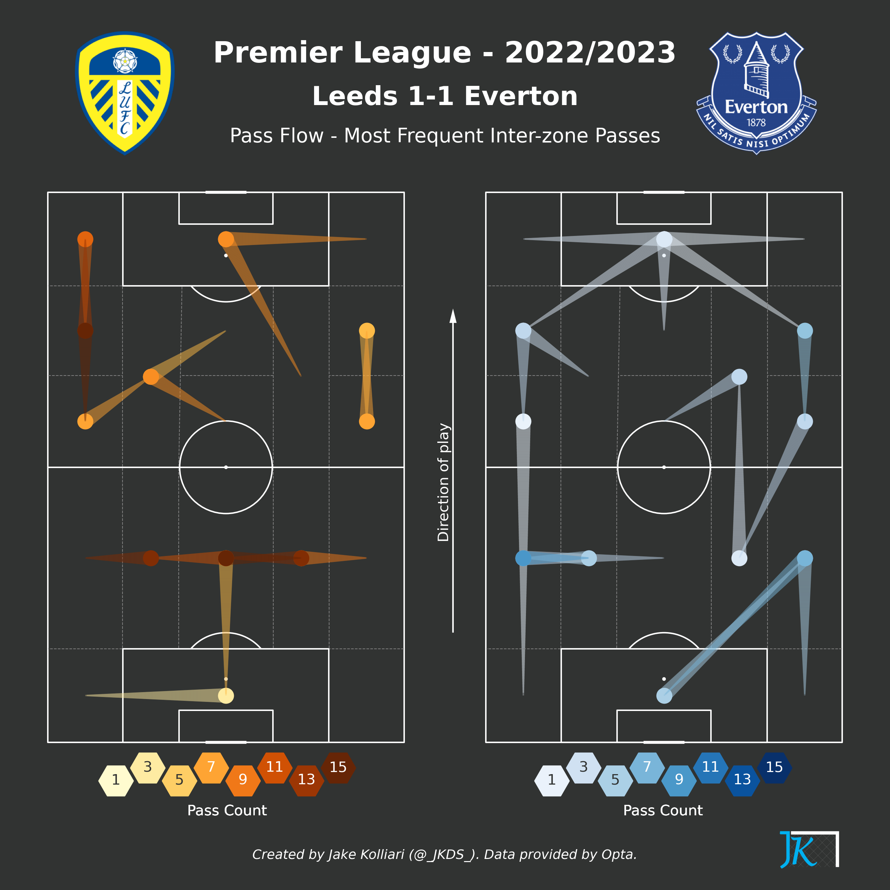 &nbsp &nbsp
  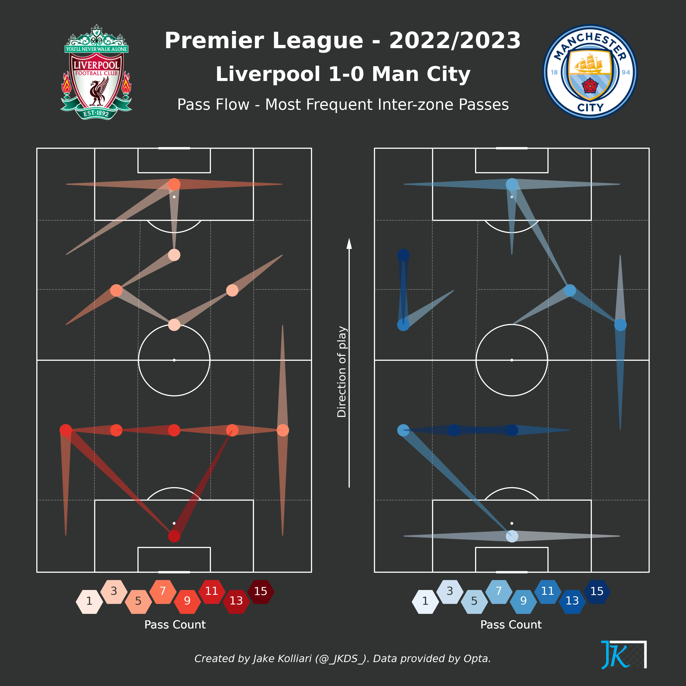 

4.3 - Offensive Territory Report

\
**Data Source:** Opta/Whoscored

**Project Area:** [04_match_reports_opta](https://github.com/jakeyk11/football-data-analytics/tree/main/projects/04_match_reports_opta)

**Code:** [pass_report_ws.py](https://github.com/jakeyk11/football-data-analytics/blob/main/projects/04_match_reports_opta/pass_report_ws.py)

**Summary and Output:** 
Design and development of an algorithm to calculate player territories based on the positions of all in-play actions throughout a match, including removal of outliers. Generation of territory reports for any selected match, including calculation of territory area as a proxy for pitch area covered.

   &nbsp &nbsp
  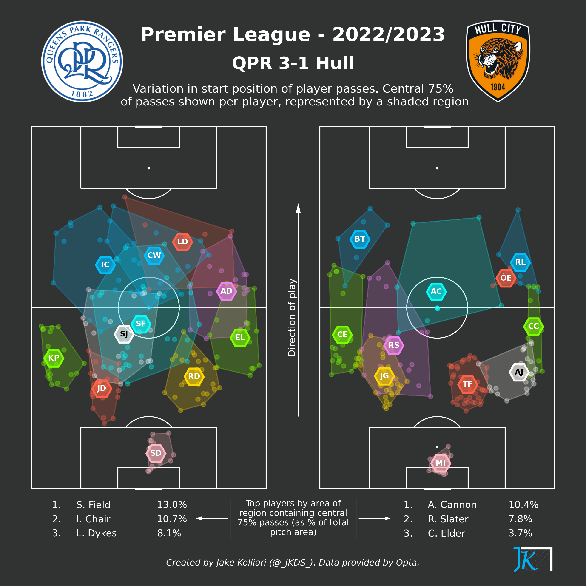 

### 5 - Player Ranking over a Competition

5.1 - Top Defensive Contributors

\
**Data Source:** Opta/Whoscored

**Project Area:** [05_competition_reports_top_players_opta](https://github.com/jakeyk11/football-data-analytics/tree/main/projects/05_competition_reports_top_players_opta)

**Code:** [player_defensive_contribution.py](https://github.com/jakeyk11/football-data-analytics/blob/main/projects/05_competition_reports_top_players_opta/player_defensive_contribution.py)

**Summary and Output:** 
Assessment of all players' defensive contribution over the duration of a competition, with identification of top players by metrics such as Recoveries and Ball Wins per 100 opposition touches. Work includes implentation of a diamond scatter diagram that can be re-used for any 2D scatter plot.

  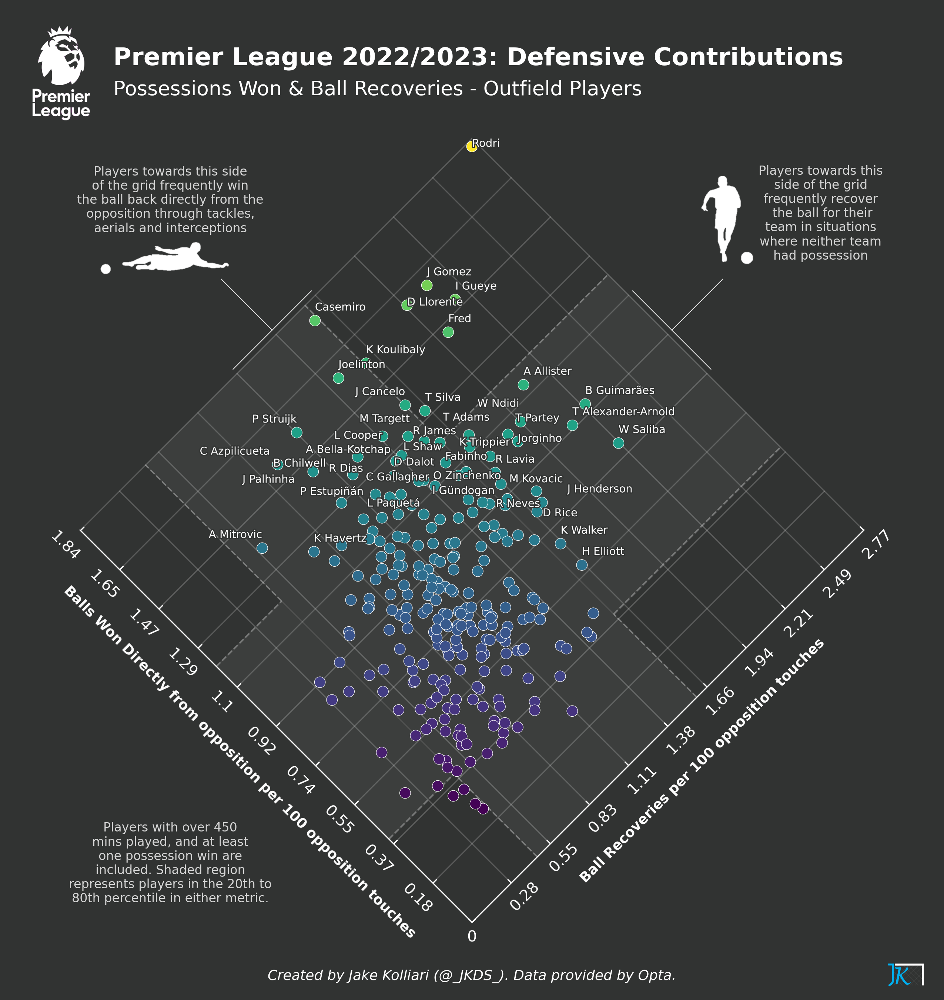 &nbsp &nbsp
  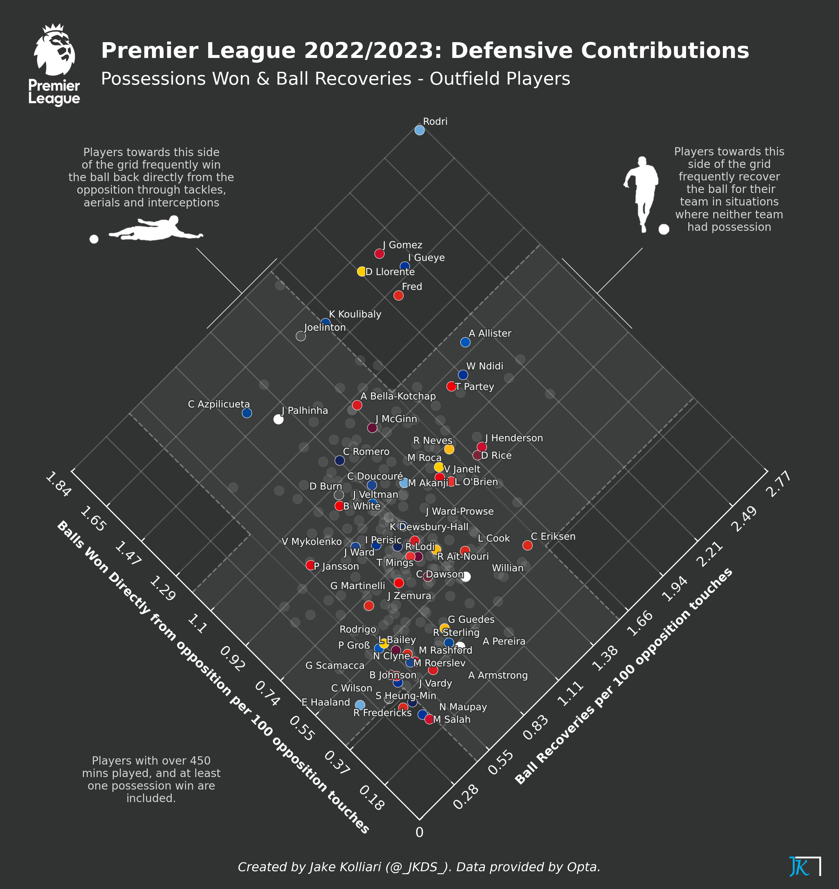 

5.2 - Top Forward Pressers

\
**Data Source:** Opta/Whoscored

**Project Area:** [05_competition_reports_top_players_opta](https://github.com/jakeyk11/football-data-analytics/tree/main/projects/05_competition_reports_top_players_opta)

**Code:** [player_defensive_contribution.py](https://github.com/jakeyk11/football-data-analytics/blob/main/projects/05_competition_reports_top_players_opta/player_defensive_contribution.py)

**Summary and Output:** 
Assessment of the number of defensive actions completed in the opposition third by all players' over the duration of a competition, giving an indication at who has a tendency to defend from the front.

   &nbsp &nbsp
   

5.3 - Top Passers

\
**Data Source:** Opta/Whoscored

**Project Area:** [05_competition_reports_top_players_opta](https://github.com/jakeyk11/football-data-analytics/tree/main/projects/05_competition_reports_top_players_opta)

**Code:** [player_effective_passers.py](https://github.com/jakeyk11/football-data-analytics/blob/main/projects/05_competition_reports_top_players_opta/player_effective_passers.py)

**Summary and Output:** 
Identification of effective passers through assessment of all in-play passes completed over the duration of a competition. Metrics such as progressive passes, cumulative expected threat and passes into opposition box per 90 are used to identify top players. This work involves the implementation of an [expected threat model](https://karun.in/blog/data/open_xt_12x8_v1.json) developed by Karun Singh.

  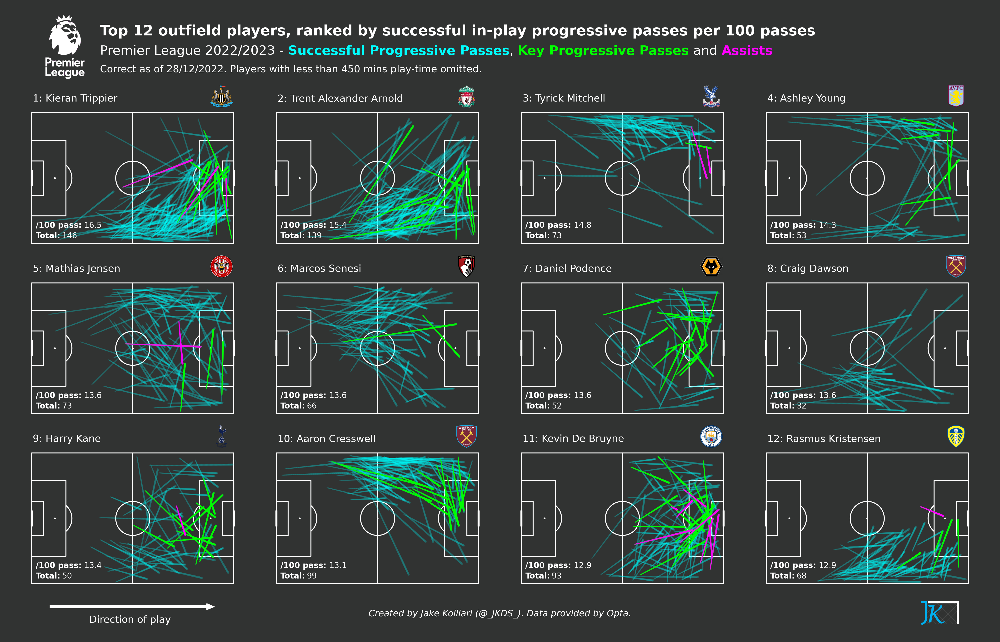 &nbsp &nbsp
  

   &nbsp &nbsp

5.4 - Top Ball Carriers

\
**Data Source:** Opta/Whoscored

**Project Area:** [05_competition_reports_top_players_opta](https://github.com/jakeyk11/football-data-analytics/tree/main/projects/05_competition_reports_top_players_opta)

**Code:** [player_effective_carriers.py](https://github.com/jakeyk11/football-data-analytics/blob/main/projects/05_competition_reports_top_players_opta/player_effective_carriers.py)

**Summary and Output:** 
Identification of effective carriers through assessment of carries completed over the duration of a competition. This work involves the development of a module to infer carry events from opta event data (as carries are not recorded).

  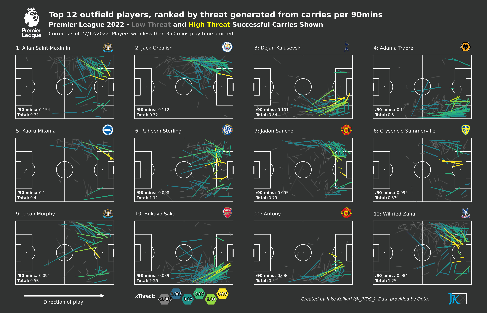 &nbsp &nbsp
  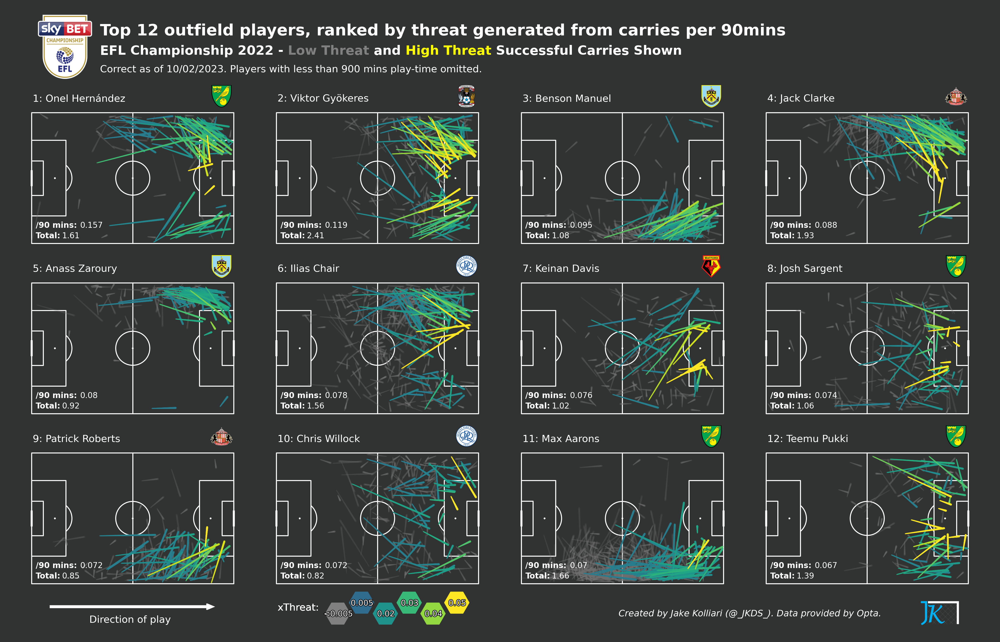

5.5 - Top Threat Creators

\
**Data Source:** Opta/Whoscored

**Project Area:** [05_competition_reports_top_players_opta](https://github.com/jakeyk11/football-data-analytics/tree/main/projects/05_competition_reports_top_players_opta)

**Code:** [player_effective_carriers.py](https://github.com/jakeyk11/football-data-analytics/blob/main/projects/05_competition_reports_top_players_opta/player_threat_creators.py)

**Summary and Output:** 
Identification of top threat creators through assessment of various events/actions completed over the duration of a competition. This work involves the implementation of an [expected threat model](https://karun.in/blog/data/open_xt_12x8_v1.json) developed by Karun Singh.

  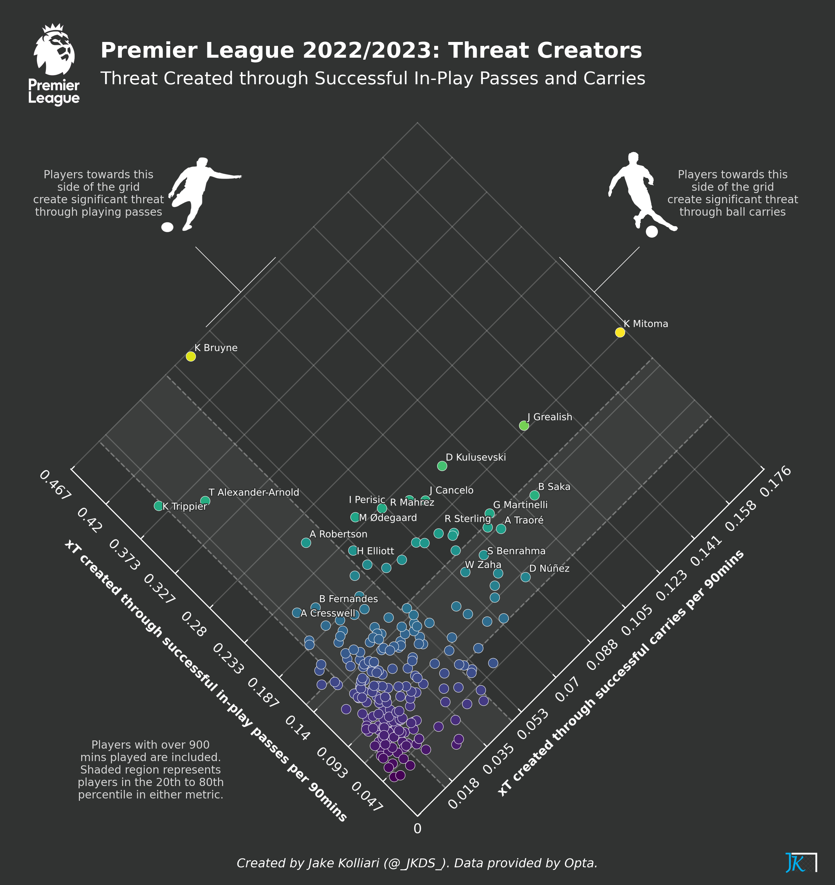 &nbsp &nbsp
  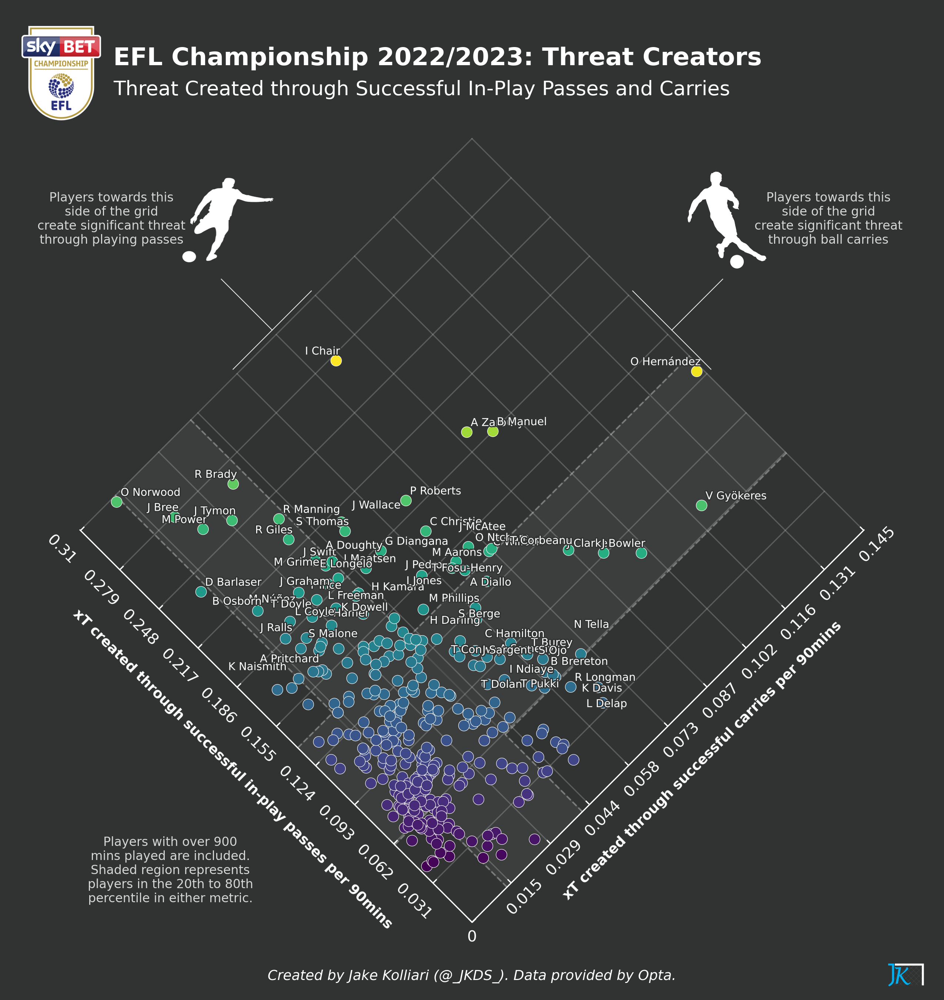

5.6 - Top Penalty Takers

\
**Data Source:** Opta/Whoscored

**Project Area:** [05_competition_reports_top_players_opta](https://github.com/jakeyk11/football-data-analytics/tree/main/projects/05_competition_reports_top_players_opta)

**Code:** [player_threat_creators.py](https://github.com/jakeyk11/football-data-analytics/blob/main/projects/05_competition_reports_top_players_opta/player_penalty_takers.py)

**Summary and Output:** 
Identification of top penalty takers across multiple competitions. Penalty quality is assessed my mean distance of on-target penalty from goalkeeper midriff, with off-target penalties assigned a distance of zero. This work includes implementation of "3D projections" within 2D subplots.

   &nbsp &nbsp
  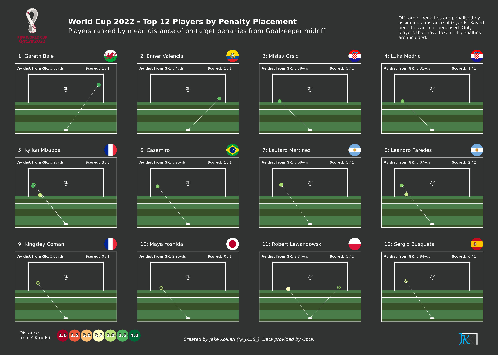

### 6 - Team Ranking over a Competition

6.1 - Zones of Threat Creation

\
**Data Source:** Opta/Whoscored

**Project Area:** [06_competition_reports_top_teams_opta](https://github.com/jakeyk11/football-data-analytics/tree/main/projects/06_competition_reports_top_teams_opta)

**Code:** [team_threat_creation.py](https://github.com/jakeyk11/football-data-analytics/blob/main/projects/06_competition_reports_top_teams_opta/team_threat_creation.py)

**Summary and Output:** 
Ranking of teams by total threat created through in-play passes and carries per 90, including identification of the zones in which each team generates threat.

  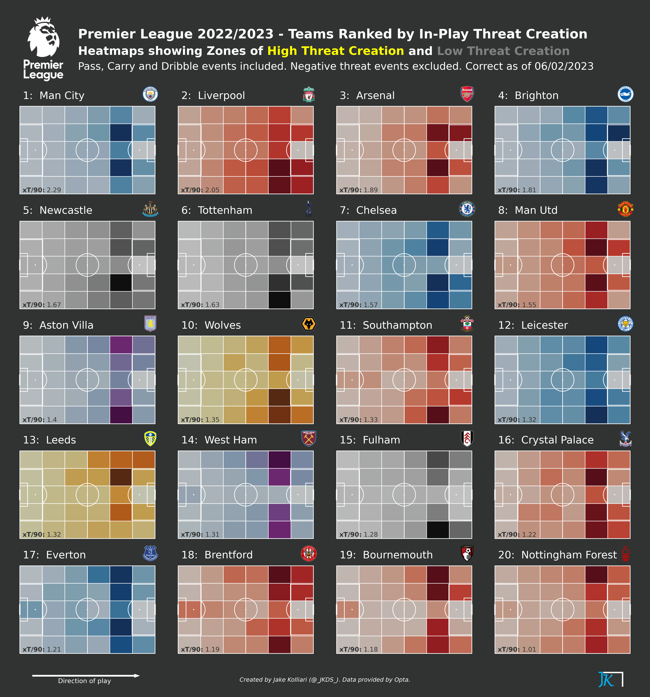 &nbsp &nbsp
  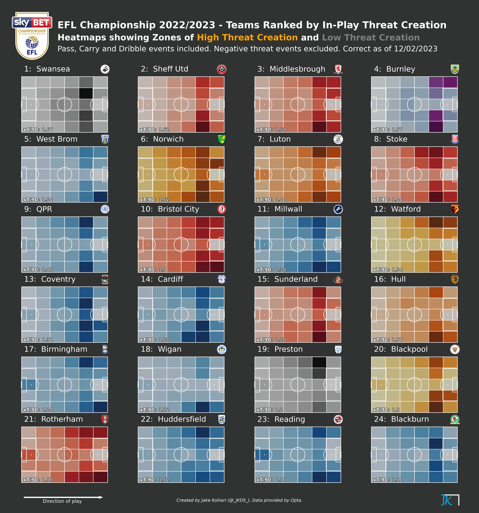

6.2 - Zones of Possession Gain

\
**Data Source:** Opta/Whoscored

**Project Area:** [06_competition_reports_top_teams_opta](https://github.com/jakeyk11/football-data-analytics/tree/main/projects/06_competition_reports_top_teams_opta)

**Code:** [team_ball_winning.py](https://github.com/jakeyk11/football-data-analytics/blob/main/projects/06_competition_reports_top_teams_opta/team_ball_winning.py)

**Summary and Output:** 
Ranking of teams by the mean height up the pitch that they win the ball back, including identification of the zones in which they gain possession of the ball from the opposition.

  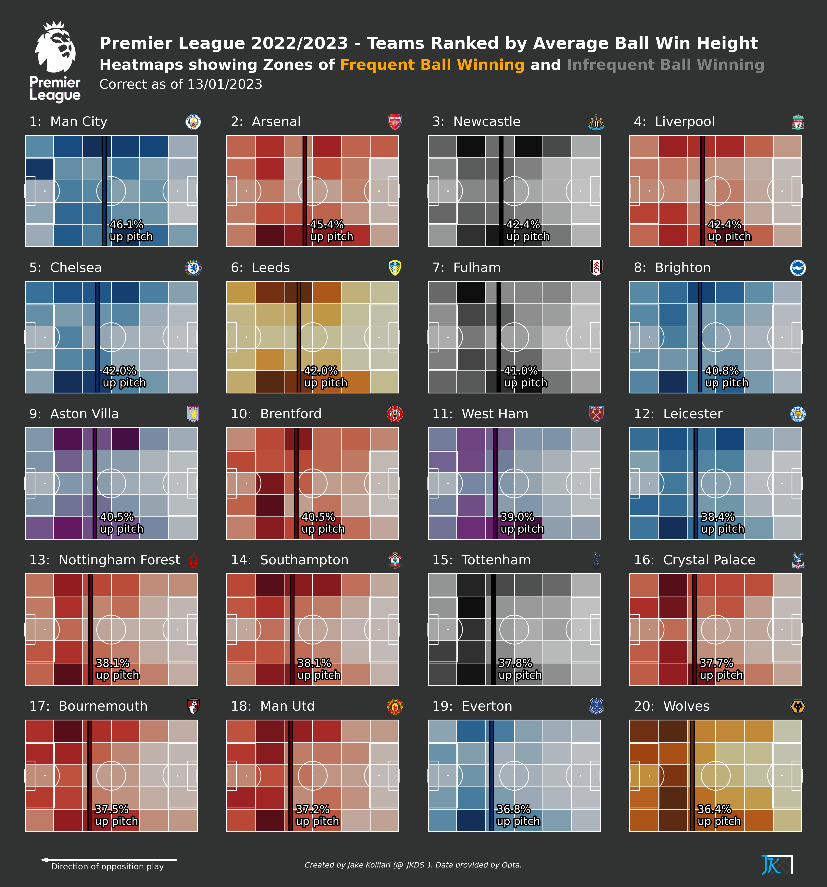 &nbsp &nbsp
  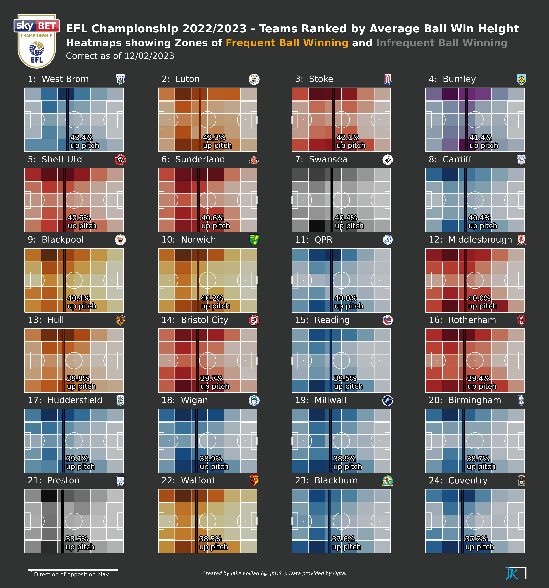

  

6.3 - Effective Crossing Teams

\
**Data Source:** Opta/Whoscored

**Project Area:** [06_competition_reports_top_teams_opta](https://github.com/jakeyk11/football-data-analytics/tree/main/projects/06_competition_reports_top_teams_opta)

**Code:** [team_cross_success.py](https://github.com/jakeyk11/football-data-analytics/blob/main/projects/06_competition_reports_top_teams_opta/team_cross_success.py)

**Summary and Output:** 
Ranking of teams by in-play cross success rate. This work includes a custom definition of an effective (or successful) cross, where an effective cross is one that is followed by either a shot or key pass within 5 seconds of play (irrespective of the inital cross outcome).

  

  

6.4 - Full-back Combinations

\
**Data Source:** Opta/Whoscored

**Project Area:** [06_competition_reports_top_teams_opta](https://github.com/jakeyk11/football-data-analytics/tree/main/projects/06_competition_reports_top_teams_opta)

**Code:** [team_fullback_combinations.py](https://github.com/jakeyk11/football-data-analytics/blob/main/projects/06_competition_reports_top_teams_opta/team_fullback_combinations.py)

**Summary and Output:** 
Ranking of teams by the frequency in which their full backs combine. Passes between full-backs of each team are identified and highlighted based on whether the pass leads to a shot on goal.
  

  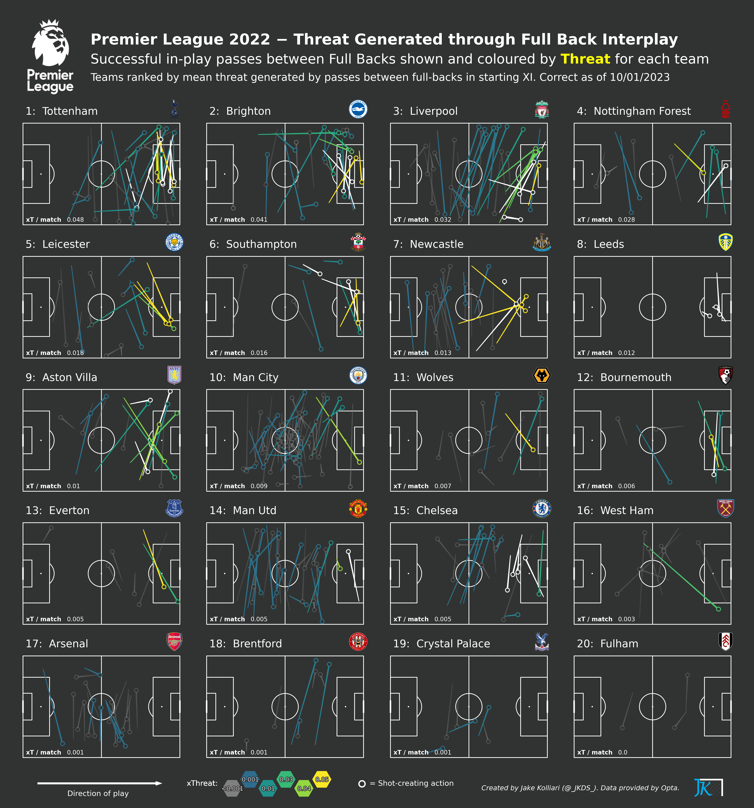

  

### 7 - Automated Player Reports

7.1 - Full-back Reports

\
**Data Source:** Opta/Whoscored

**Project Area:** [07_player_reports_opta](https://github.com/jakeyk11/football-data-analytics/tree/main/projects/07_player_reports_opta)

**Code:** [player_report_fullback.py](https://github.com/jakeyk11/football-data-analytics/blob/main/projects/07_player_reports_opta/player_report_fullback.py)

**Summary and Output:** 
Player report specific to full-backs, including development of a flexible/robust mechanism to compare the report subject to similar players, and then rank the set of players against all full-backs within a chosen league.
  

   &nbsp &nbsp
  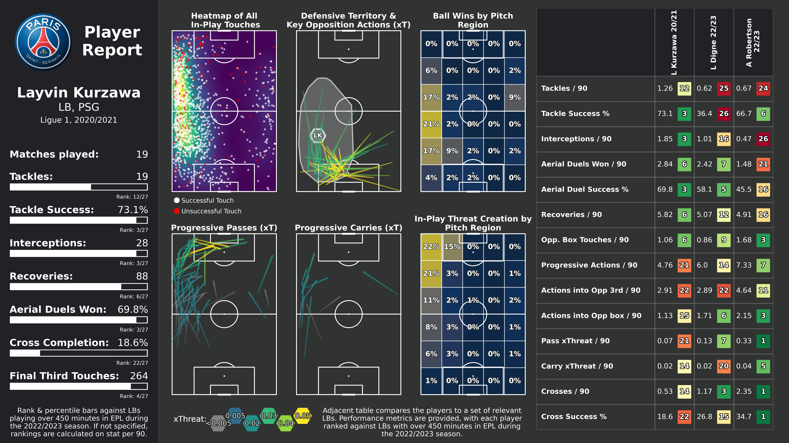

  

