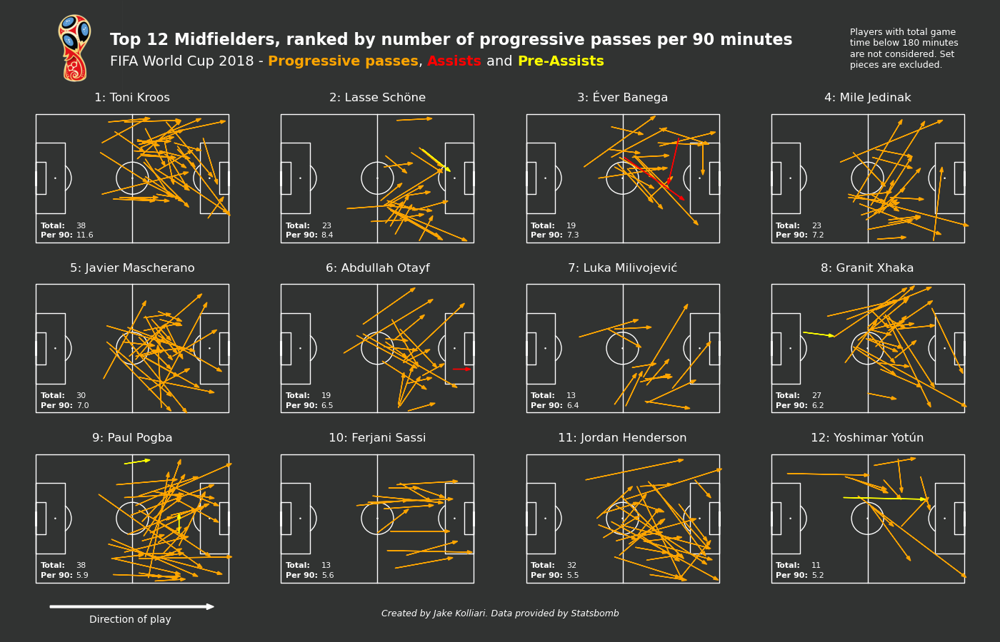
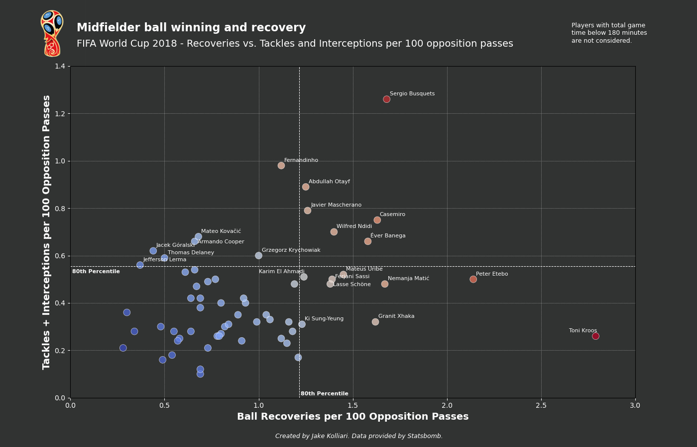
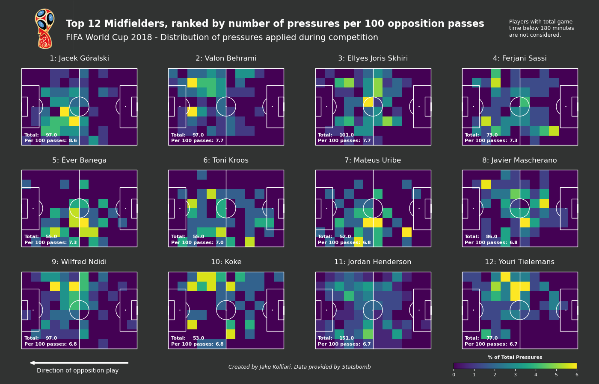
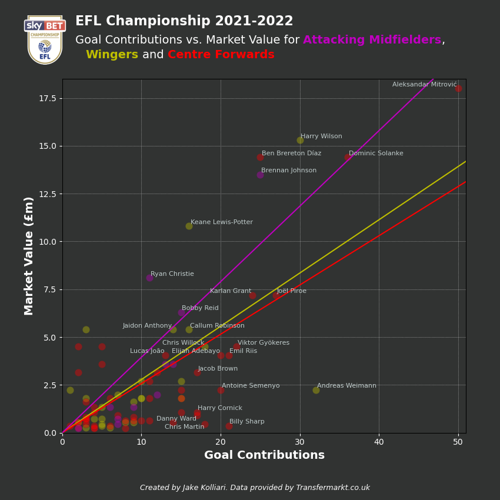
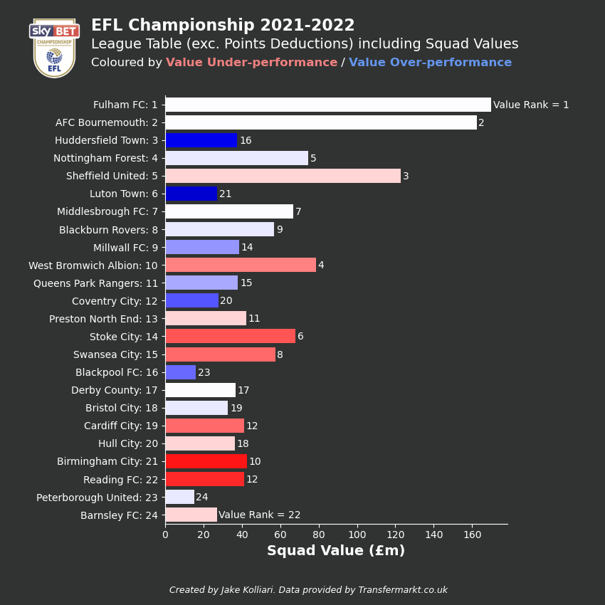
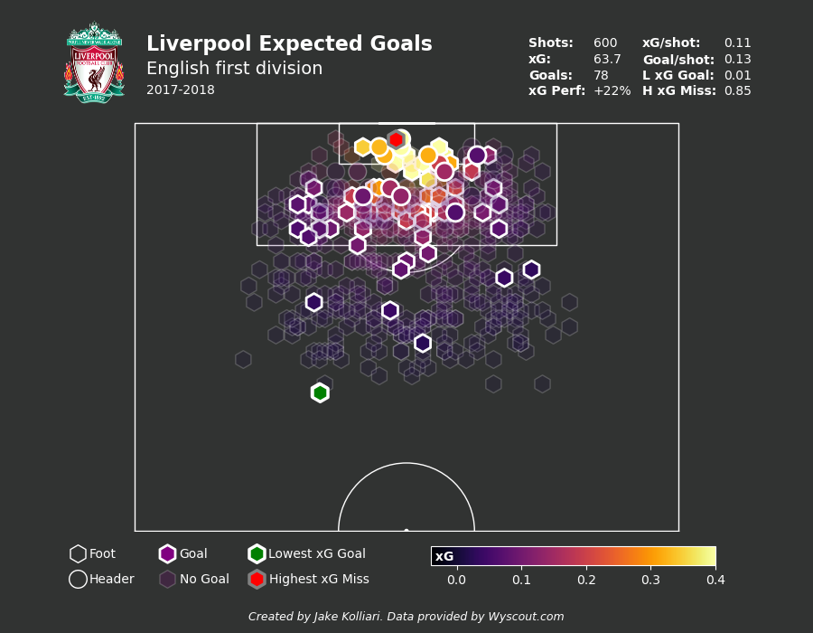

# Football Data Analytics
This repository contains a collection of tools, scripts and projects that focus on analysis and visualisation of football data.

## Folders / Workflow
- **data_directory**: Collection of raw football data used for projects. Also contains any template scripts used to import raw data from various football data APIs, websites or data services.
- **analysis_tools**: Python package containing modules that support football data pre-processing, manipulation and visualisation.
- **projects**: Series of personal projects, as previewed below, that cover various elements of football data analytics.

In general, each project follows a number of logical steps:
1. Within data_directory, use template data import scripts to save data in compressed BZ2 format.
2. Create new script(s), referred to here as the main script(s), in the project folder and import required analysis_tools modules.
3. Within main script, import required compressed BZ2 data as pandas dataframe.
4. Pre-processes and format data using relevant data_engineering module, within analysis_tools.
5. Syntehsise additional information using relevant custom_events module, within analysis_tools.
6. After completing further project work, create visualisations using relevant data_vis module, within analysis_tools.

## Projects

Project table of contents:  
&nbsp; &nbsp; [01 - World Cup 2018 Box to Box Midfielder Analysis](#01---world-cup-2018-box-to-box-midfielder-analysis)  
&nbsp; &nbsp; [02 - Transfermarkt Web-Scrape and Analyse](#02---transfermarkt-web-scrape-and-analyse)  
&nbsp; &nbsp; [03 - Expected Goals Modeling](#03---expected-goals-modeling)
&nbsp; &nbsp; [04 - Automated Match Reporting](#04---automated-match-reporting)

### 01 - World Cup 2018 Box to Box Midfielder Analysis

**Summary**: Use Statsbomb data to define the most effective box to box midfielders at the 2018 World Cup. Throughout the work a number of custom metrics are used to score central midfielders in ball winning, ball retention & creativity, and mobility. A good box to box midfielder is defined as a central midfielder that excels in each of these areas. Of key interest in this work is the use of convex hulls as a proxy for player mobility / distance covered. The work also includes the development of a number of appealing visuals, as shown below.

   &nbsp &nbsp
   &nbsp &nbsp
  

   &nbsp &nbsp
   &nbsp &nbsp
  

### 02 - Transfermarkt Web-Scrape and Analyse

**Summary:** Scrape team and player market value information from transfermarkt.co.uk. This work includes the development of a "scouting tool" that highlights players from a given league that have a favourable combination of Age and Goal Contribution per £m market value. The work also explores the use of statistical models to predict market value based on player performance, as well as identifies teams that under and over-performed (league position) based on squad value.

   &nbsp &nbsp
   &nbsp &nbsp
  

### 03 - Expected Goals Modeling

**Summary:** Implementation and testing of basic expected goals probabilistic models. This work includes development and comparison of a logistic regression expected goals model and a neural network expected goals model, each trained off over 40000 shots taken across Europe's 'big five' leagues during the 2017/2018 season. The models are used to calculated expected goals for specific players, clubs and leagues over a specified time period.

   &nbsp &nbsp
   &nbsp &nbsp

   &nbsp &nbsp
   &nbsp &nbsp
   &nbsp &nbsp

### 04 - Automated Match Reporting

**Summary:** Development of automated scripts to produce match reports immediately after a match has concluded. This work includes collection and processing of public-domain match event data, and the production of multiple visuals that together constitute an informative and appealing match reports. Visuals currently include shot maps, with expected goals race charts, pass maps, and defensive zones to be added.

   &nbsp &nbsp
   &nbsp &nbsp

